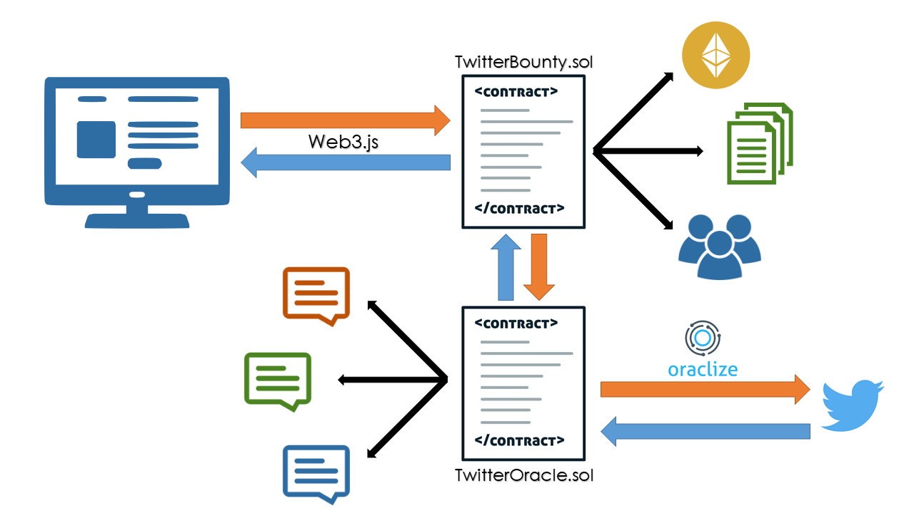

# Twitter Bounty - A Ethereum Based Twitter Bounty
### ConsenSys Academy 2018 Developer Program Final Project - Shawn Tabrizi

In short, this dApp is a bounty service which allows users to pay and get paid to post specific messages on Twitter.

## Quickstart
### Install prerequisites
1. Install the Truffle framework:

       npm install -g truffle
2. Install the Ganache CLI:

       npm install -g ganache-cli

### Running Twitter Bounty Locally
1. Clone this repository
2. Initialize and install the `ethereum-bridge` submodule

       git submodule init
       git submodule update
3. You will need to open 4 seperate console windows:

    1. Use one to initialize the Ganache CLI

           ganache-cli
       Make sure to copy your seed phrases for MetaMask.
    2. Use one to initialize the `ethereum-bridge`

           cd /path/to/ethereum-bridge
           npm install
           node bridge -a 9 -H 127.0.0.1 -p 8545 --dev
    3. Use one to `migrate` the contracts using Truffle. You might need to run these in PowerShell rather than CMD.

           cd /path/to/twitter-bounty
           truffle compile
           truffle migrate --develop --reset

    4. Finally, use one to start the `lite-server`

           cd /path/to/twitter-bounty
           npm run dev

4. Your browser should automatically open up the Twitter Bounty webpage. To interact, make sure you have [installed and configured MetaMask](https://truffleframework.com/tutorials/pet-shop#installing-and-configuring-metamask).

## How does it work?

Twitter Bounty is broken up into two Ethereum smart contracts:

### TwitterOracle.sol
The Twitter Oracle smart contract uses [Oraclize.it's](http://www.oraclize.it/) `oraclize-api` library to retrieve the message text of posts on Twitter via URL. These messages are stored on the Ethereum blockchain within this smart contract, and is publicly accessible by any other smart contract.

Any user or contract can call this contract to store a new Twitter message. Storing the data from Oraclize callback requires this contract also has balance of Ether to function, and anyone can contribute ether to keep the oracle running.

### TwitterBounty.sol
The main Twitter Bounty smart contract is similar to [Bounties Network's](https://github.com/Bounties-Network/StandardBounties) `StandardBounties.sol`. Using the data on the Twitter Oracle smart contract, users are able to open new bounties or claim fulfillment rewards on existing ones.

Completing a bounty requires that a user prove that a new tweet that has not been used in the past contains the same text as the original Twitter post for the bounty. Because this proof can be done programatically, bounty verification and reward resolution can happen all at once, and without the need of the bounty creator to verify or accept fulfillments.

Bounty creators have control over their bounties, and can edit the fulfillment rewards or close open bounties. Anyone can contribute to existing bounties to continue to fund them and encourage others to keep fulfilling the bounty.

## How is this useful?
Twitter Bounty enables a decentralized and simple way for people to advertise or spread messages in an organic way. Imagine that you just released a new product, and you want others to share your product. Rather than paying for an ad, you can harness a community of Twitter users to share your product with their networks. For their efforts, you can automatically pay them using this bounty system.

For example, the original bounty creator can make a post like:

> Hey have you heard about @TwitterBountyETH?

Then using the Twitter Bounty website and smart contracts, they can have others make the same post, and claim rewards for doing so.

## How do I create a bounty?

## Developer Details

### Truffle Tests
    cd /path/to/twitter-bounty
    truffle test

    <break>

    Contract: TwitterOracle.sol
        Testing functionality of the Twitter Oracle Contract
        √ Contract should be owned by contract creator (account[9])
        √ Should have logged a new Oraclize query (1132ms)
        √ Callback should have logged an update event (7561ms)
        √ Text should be stored from twitter post
        √ Text should match what is expected from twitter
        √ Contract should be pauseable (779ms)
        √ Contract should not work when paused (62ms)
        √ Contract should be destructible (594ms)

    Contract: TwitterBounty.sol
        Testing functionality of the Twitter Bounty Contract (requires TwitterOracle)
        √ Contract should be owned by contract creator (account[0]) (63ms)
        √ Contract should be connected to Twitter Oracle
        √ [1] Contract should be able to oraclize tweet through Twitter Oracle (1658ms)
        √ [1] Twitter Oracle should have logged an update event for tweet (7657ms)
        √ [1] Text should match what is expected from twitter (62ms)
        √ [2] Contract should be able to oraclize tweet through Twitter Oracle (1459ms)
        √ [2] Twitter Oracle should have logged an update event for tweet (7642ms)
        √ [2] Text should match what is expected from twitter (38ms)
        √ [3] Contract should be able to oraclize tweet through Twitter Oracle (1529ms)
        √ [3] Twitter Oracle should have logged an update event for tweet (7104ms)
        √ [3] Text should match what is expected from twitter
        √ Contract should be able to create bounties (117ms)
        √ Any user should be able to contribute to bounty (81ms)
        √ Bounty should reject an already used tweet (38ms)
        √ Bounty should reject a mismatched tweet
        √ Bounty should accept a different, yet matching tweet (64ms)
        √ Bounty should pay out when fulfilled (142ms)
        √ Bounty cannot be modified by non-owner (48ms)
        √ Bounty can be closed by owner (67ms)
        √ Contract should be pauseable (871ms)
        √ Contract should not work when paused (87ms)
        √ Contract should be destructible (581ms)

    30 passing (40s)
